# MenuFit

## Team

- Tiago Filipe da Cunha Fernandes - 2022156526 - a2022156526@isec.pt
- Juliano Mak Babaroca - 2022119541 - a2022119541@isec.pt
- Bárbara Sousa Trindade - 2022144651 - a2022144651@isec.pt 
- Júlio Pacheco - 2017018694 - a21270050@isec.pt
- Diogo Rodrigues - 2022148578 - a2022148578@isec.pt

## Vision and Scope

#### Problem Statement

###### Project Background
In today's fast-paced world, many individuals struggle with creating a meal plan due to time constraints and a lack of knowledge. This can lead to poor dietary choices, which may not align with their personal health goals, dietary restrictions, or financial limitations.

###### Stakeholders
- Individual users
- Nutritionists
- Fitness companies
- Health and Fitness enthusiasts

###### Users
- User with a profile

***

#### Vision & Scope of the Solution

###### Vision statement
To empower individuals to take control of their nutrition and wellness by providing a simple, personalized, and time-saving meal planning experience. Whether striving for a healthier lifestyle, managing dietary restrictions, or maintaining a balanced routine, our app adapts to unique needs and schedules, making healthy eating accessible, enjoyable, and effortless for everyone.

###### List of features
- Generate a full week meal plan based on user input
- Create and Configure a user profile
- Set restrictions for the meal plan (food restrictions, cost restrictions, meal complexity, calorie goals, dietary objective)
- Get information on how to prepare the meals
- Notifications for meal prep times or ingredients.

###### Features that will not be developed
- Connection to shopping app
- Set favourite meals to be considered in the generation on the meal plan

###### Assumptions
Users will seek health and nutritional advice before committing to the meal plan generated by the application. Users are motivated to follow through on the meal plan. Users will provide as much information about any food restrictions they might have, and will keep this information up to date. Users will want a weekly meal plan.

***

## Requirements
#### Use Case Diagram
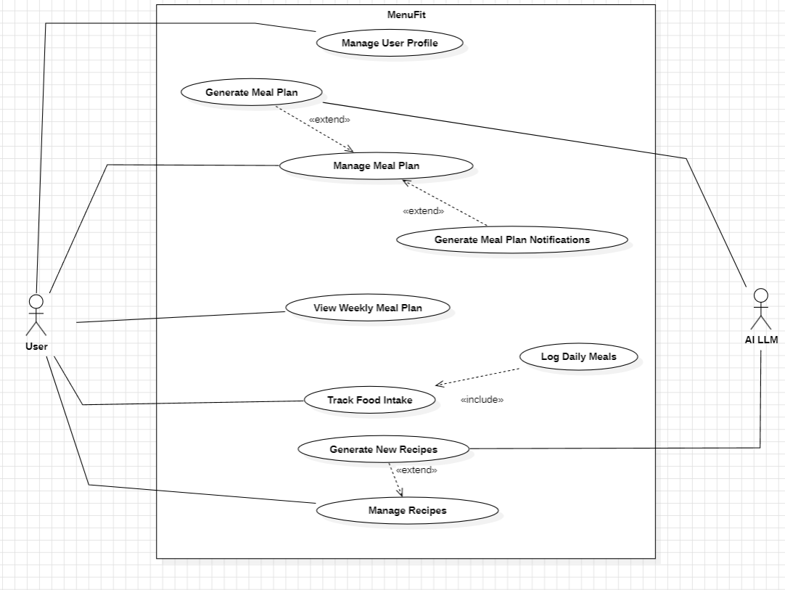

#### Mockups
#### User Story 1
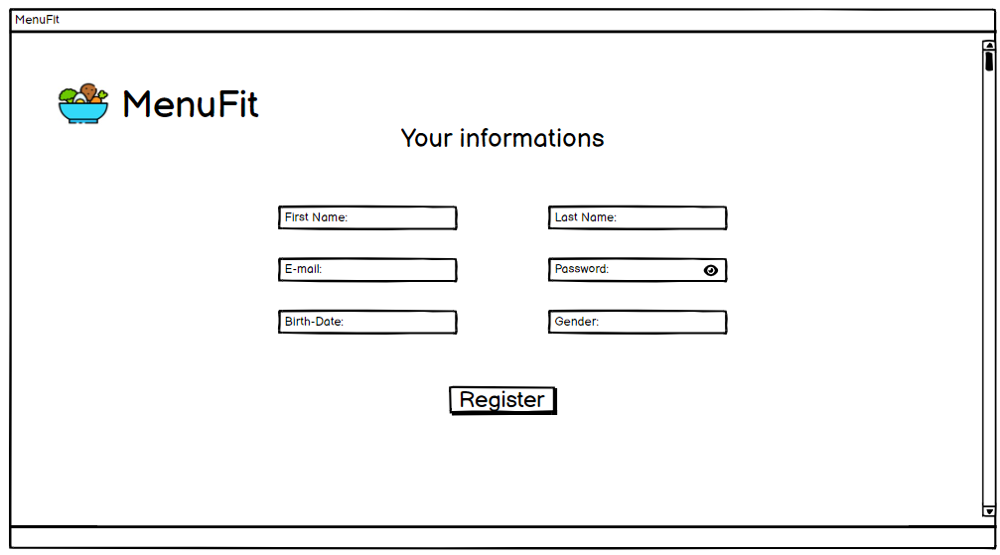

#### User Story 2

#### User Story 3
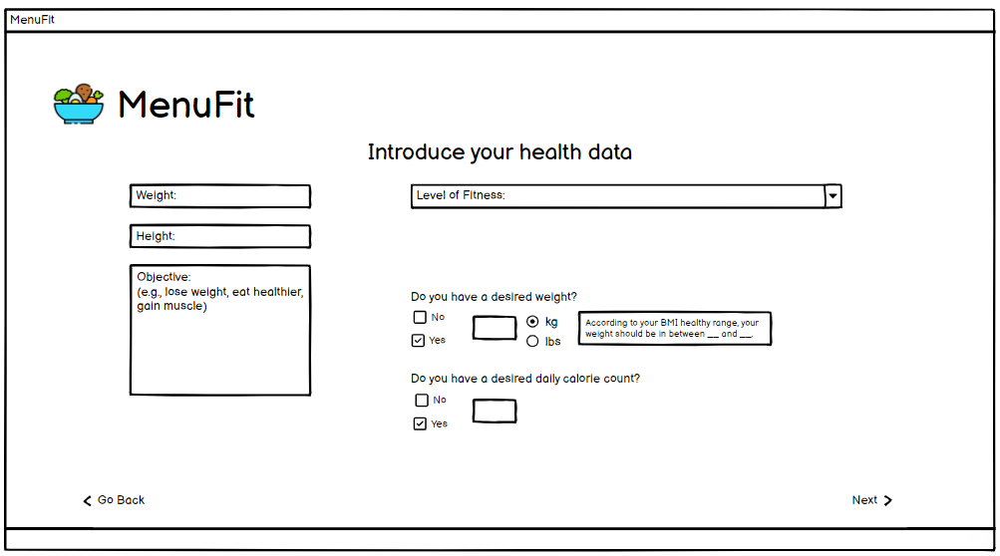
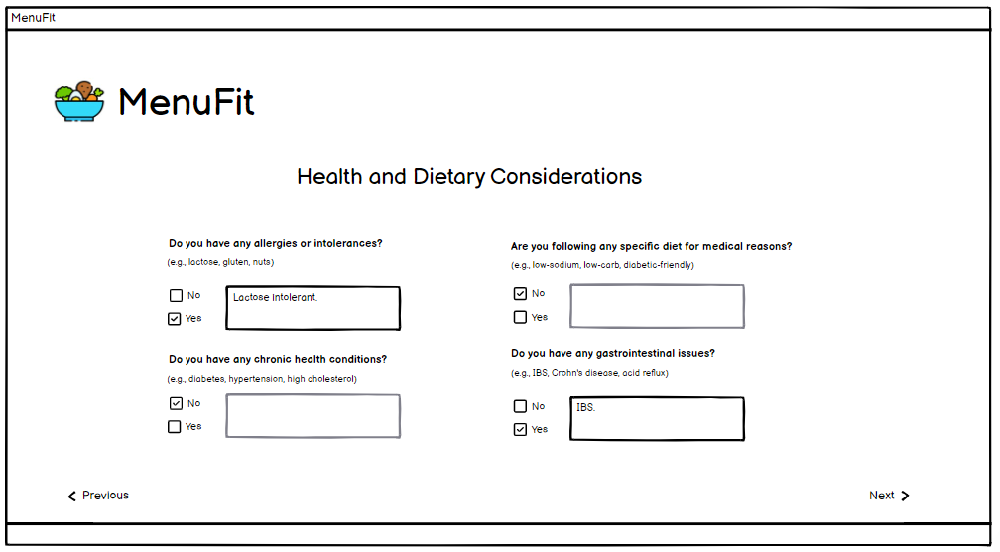
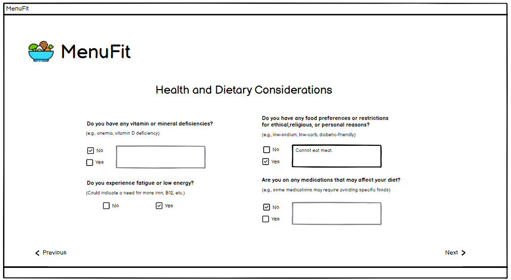

#### User Story 4
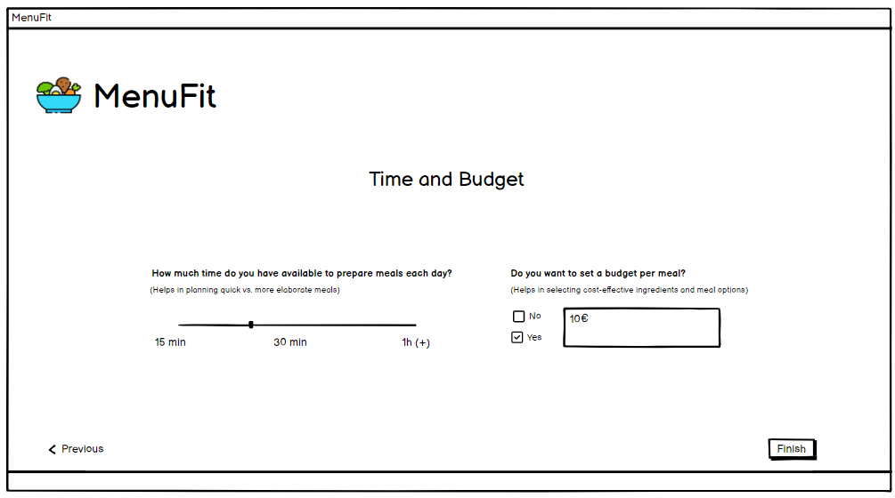

#### User Story 5, 8
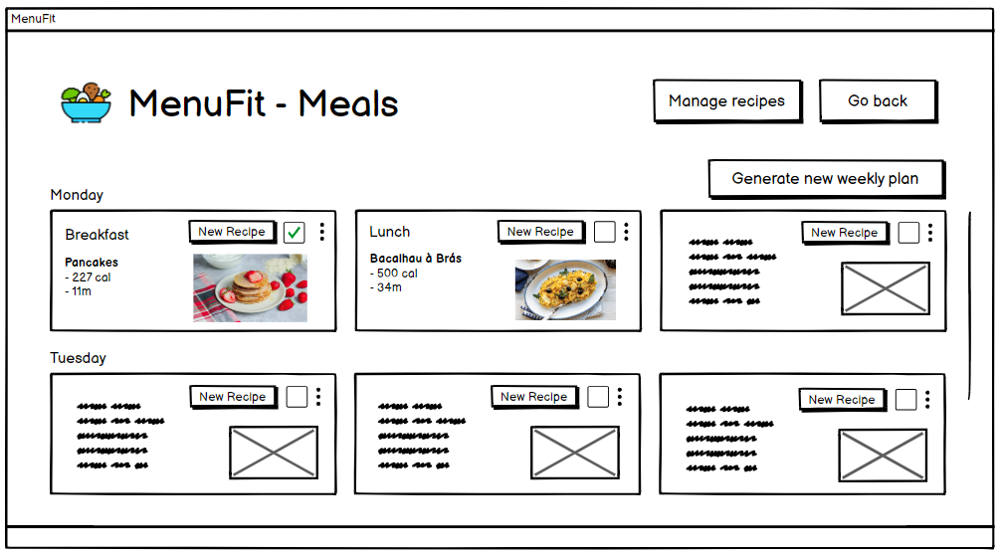

#### User Story 5, 7, 10
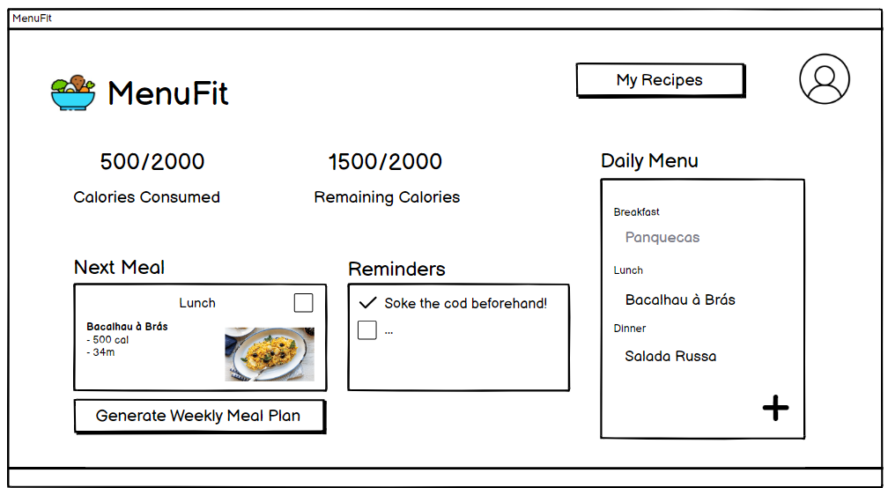

#### User Story 6
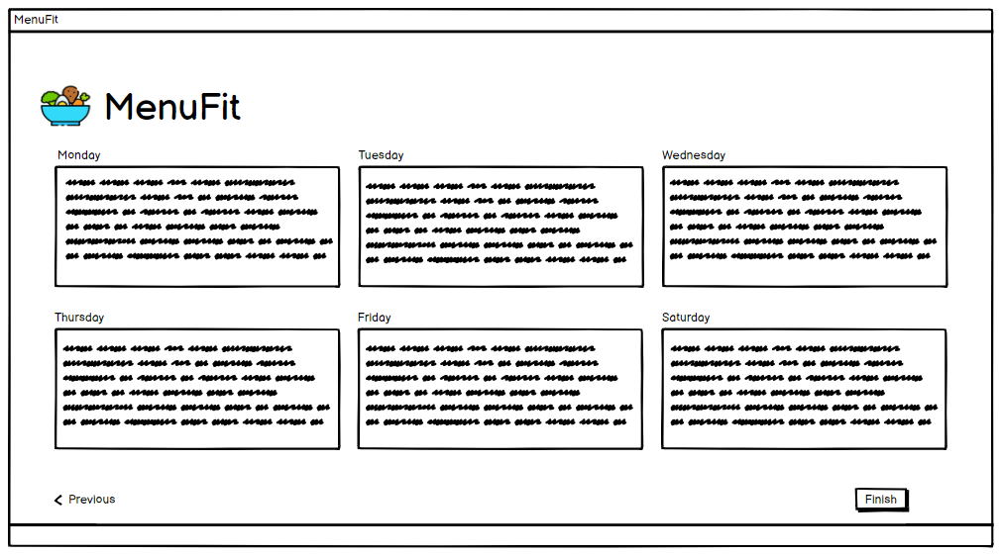

#### User Story 9
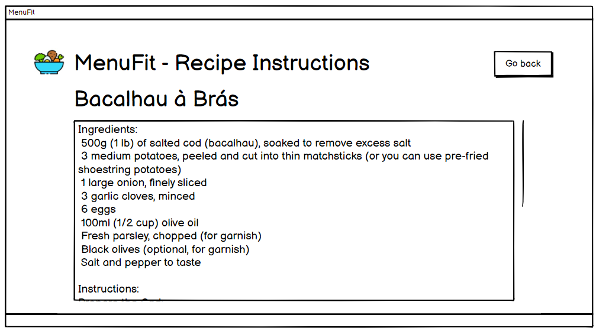

#### User Story 11
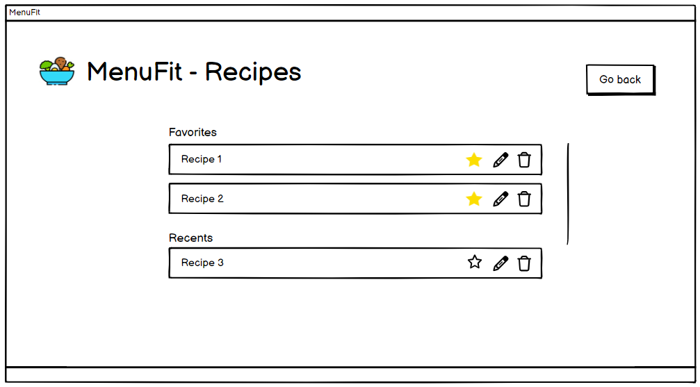

#### User Stories
- User Story 1 (#13)
- User Story 2 (#12)
- User Story 3 (#15)
- User Story 4 (#14)
- User Story 5 (#22)
- User Story 6 (#45)
- User Story 7 (#19)
- User Story 8 (#18)
- User Story 9 (#17)
- User Story 10 (#44)
- User Story 11 (#21)

## Definition of Done
- All tasks done:
    - CI – built, tested (Junit), reviewed (SonarCloud)
    - Merge request to qa (code review)
- Acceptance tests passed
- Accepted by the client
- Code merged to main

***

## Architecture and Design

#### Domain Model
<!---->

***

## Risk Plan

##### Threshhold of Success
<!---
The project fails if:
 Essential features such as habit tracking, visual progress insights, task and habit management, reminders, and goal setting are incomplete or not functioning as intended.
Users find it difficult to navigate the app or encounter usability issues, leading to dissatisfaction and disengagement.
Reminders are unreliable, causing users to miss their tasks and habits frequently.
Milestone tracking for goals is confusing or not visually represented clearly, leading to user frustration.

- The "must" user stories are not developed
- The app is not in a working condition upon release.
The team is not satisfied with the app and their work on the project, based on a questionare at the last meeting before final release. -->

The project is successful if:
<!--- By the final release date, all essential features, namely habit tracking, task and habit management and reminders, are fully implemented and pass acceptance tests without critical defects.
Users find the app intuitive, user-friendly, and engaging, leading to positive feedback and a high level of satisfaction.
Reminders are delivered accurately and on time, ensuring users can effectively manage their tasks and habits.
Milestone tracking for goals is visually appealing, easy to understand, and provides users with a sense of achievement and progress. -->

- All "must" user stories are developed and tasks assigned to them finished.
- All group members contibuted to the project equally (rounded up to the nearest hour).
- The team is satisfied with the app and their work on the project, based on a questionare at the last meeting before final release.
<!-- - The interface of the app it appealing to most group members and clients. -->

##### Risk List
<!-- - RSK1 - PxI: 4x5=20; Inaccurate Time and Effort Estimations
  - Risk: The team lacks experience in estimating the time and effort required for tasks, leading to underestimations or        overestimations, resulting in unforeseen project delays.
  - Impact: 5
  - Likelihood: 4 -->

##### Mitigation Actions (threats>=20)

***

## Pre-Game
### Sprint 0 Plan

- Goal: description
- Dates: from 1/Oct to 15/Oct, 2 weeks
- Sprint 0 Backlog:
  - Task1 – Write Team
  - Task2 – Write V&S
  - Task3 – Write Requirements
  - Task4 – Write DoD
  - Task5 – Write Architecture&Design
  - Task6 – Write Risk Plan
  - Task7 – Write Pre-Gane
  - Task8 – Write Release Plan
  - Task9 – Write Product Increments
  - Task10 – Create Product Board
  - Task11 – Create Sprint 0 Board
  - Task12 – Write US in PB, estimate (SML), prioritize (MoSCoW), sort
  - Task13 – Create repository with “GPS Git” Workflow
  
***

## Release Plan

### Release 1

- Goal:
    -
    -
    -
- Dates: 11/Nov
- Team capacity: 4 * 4 * 5 = 80 hours
- Release: V1.0

***

### Sprint 1
##### Sprint Plan

- Goal: <!-- Create the base architecture of the app and basic interface. -->
  - 
  - 

- Dates: from 15/Oct to 29/Oct, 2 weeks

- Roles:
  - Product Owner: Júlio Pacheco
  - Scrum Master: Juliano Babaroca

- To do:
  - US1: As a user, I want to be able to see which tasks I need to complete or the ones I already completed. (alterar, apenas exemplo)

  - US2: 

  - US3: 
  
  - US4: 
  
  - US5: 
  
  - US6: 
  
  - US7: 
  
  - US8:
  
  - US9: 
  
  - US10:  

  
- Story Points: (alterar)2S+2M

- Analysis: short analysis of the planning meeting

##### Sprint Review